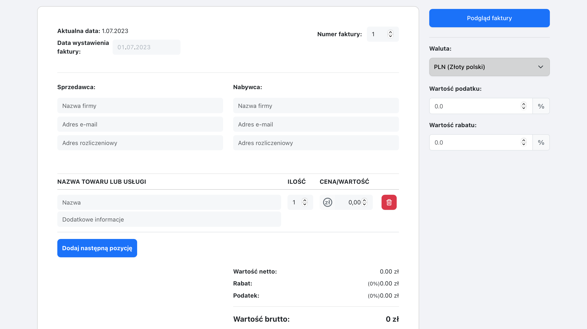
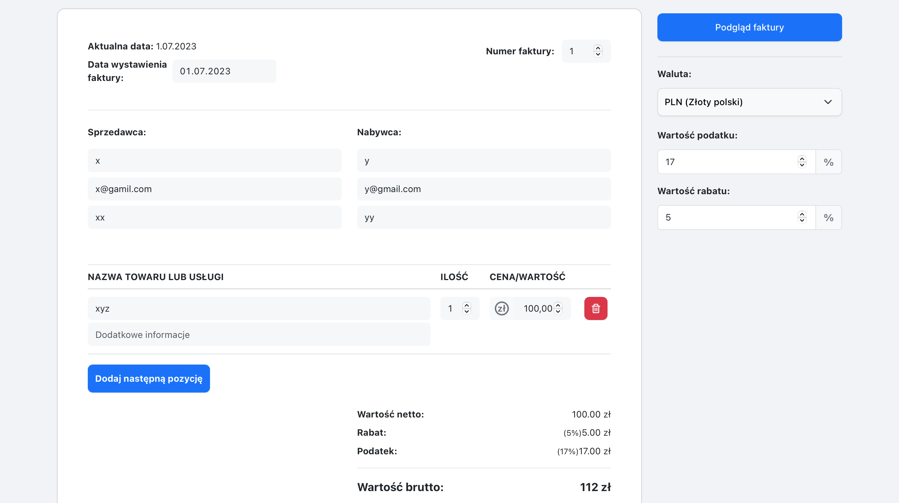
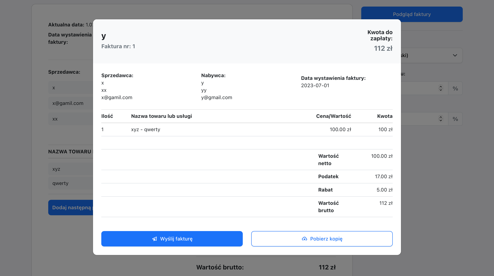

# Fakturax
The invoice generator web application, built using React, provides a user-friendly invoice creation solution. With an intuitive interface, users can easily enter customer information, add items and services, and calculate totals with automatic tax and discount calculations.

#### Live demo [_here_](http://fakturax.pl/).

## Technologies Used
- React.js
- react-bootstrap

## Features
- Fully responsive and mobile friendly
- Users can issue an invoice
- Users can add and edit personal data on the invoice
- Users can choose currency, tax rate and discount
- Automatic pre-filling of supplier details from the last invoice
- Users can download the invoice in PDF format
- All data is stored in the browser's memory (localStorage)

## Screenshots

